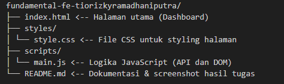
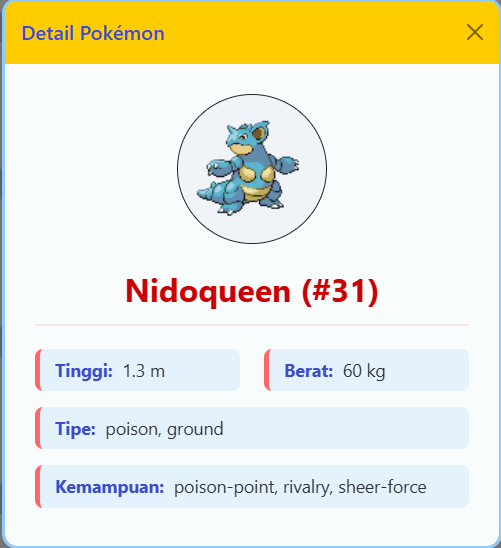
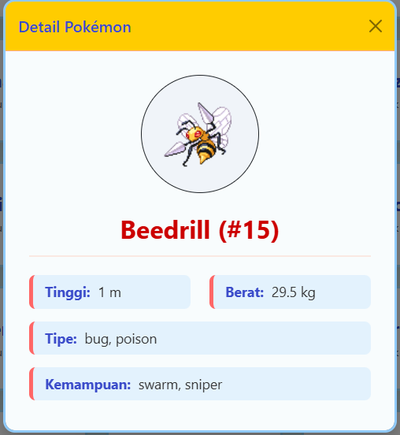
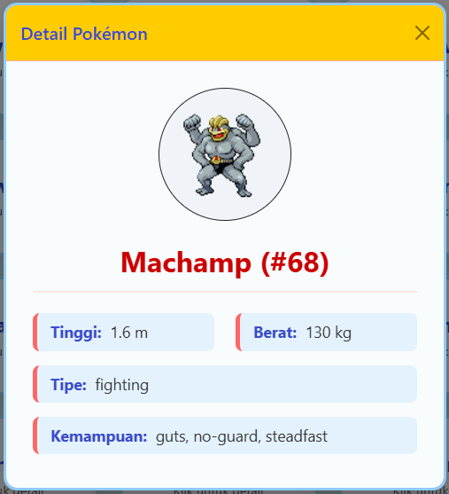

# fundamenteal-fe-pokemonAPI

# 🧠 Fundamental Front-End Developer

Belajar dasar-dasar pengembangan antarmuka pengguna (Front-End) menggunakan HTML, CSS, dan JavaScript.  
Proyek ini merupakan bagian dari program **BPSDMP Komdigi Jogja X METRODATA Bootcamp Java**.

---

## 👤 ID
**Tio Rizky Ramadhani Putra** || Mentor Pembimbing : **Fuad Zein**

---

## 🚀 Deskripsi Proyek
Pada tugas ini, saya membuat **Dashboard Data Teman** yang menampilkan informasi dari API `Star Wars`.  
Aplikasi ini juga dilengkapi dengan fitur **modal detail** untuk menampilkan informasi karakter secara lebih lengkap.

Fitur utama:
- Tampilan Dashboard responsif
- Modal detail untuk setiap karakter
- Implementasi dasar JavaScript DOM & Event
- Struktur file rapi (HTML, CSS, JS)

## 📂 Struktur Direktori

---

## 📸 Hasil Screenshot

### 🖥️ Dashboard Tampilan Utama

---

### 📋 Modal Detail 

---

## 💡 Pembelajaran yang Didapat
- Cara mengelola struktur file front-end (HTML, CSS, JS)
- Penggunaan `fetch()` untuk ambil data API
- Manipulasi DOM untuk menampilkan data dinamis
- Membuat dan mengatur modal secara interaktif
- Pentingnya responsive design dan UX sederhana

---

## 🧩 Tools yang Digunakan
- **HTML5**, **CSS3**, **JavaScript (Vanilla)**
- **Visual Studio Code**
- **Git & GitHub Classroom**

---

## ✨ Catatan
> File screenshot dapat ditemukan pada folder `/assets`.  
> Semua kode dikembangkan untuk keperluan pembelajaran dasar Front-End Developer.

---

### 📚 Program
**BPSDMP Komdigi Jogja Bootcamp Java**  
© 2025 – All rights reserved.

